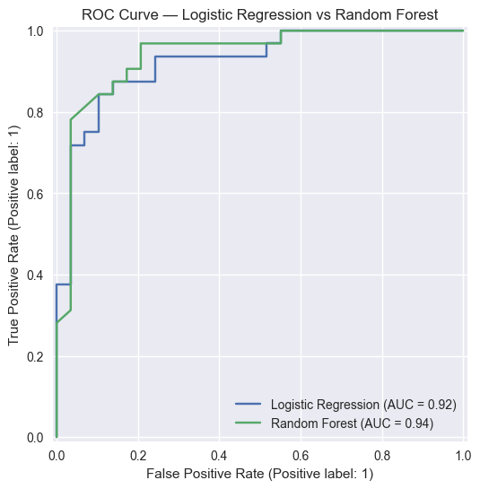
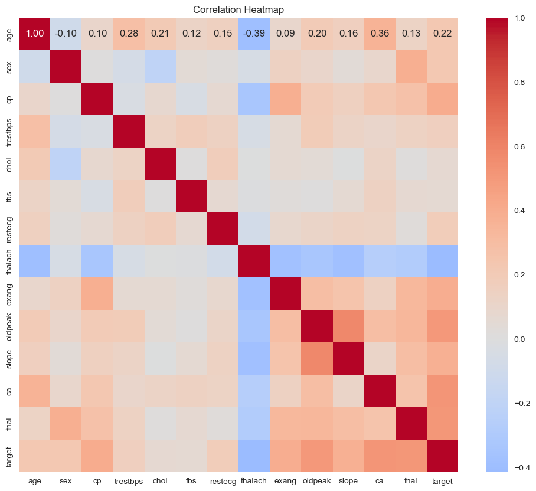

# Heart Disease Classification


End-to-end machine learning pipeline for predicting heart disease presence using the 
Cleveland Heart Disease dataset.
---
## Overview

In this project I build a full ML pipeline to predict whether a patient has heart disease 
based on clinical measurements. Using the UCI Cleveland Heart Disease dataset of 303 
patients, I performed exploratory data analysis, feature engineering, and trained two 
classification models — Logistic Regression as a baseline and Random Forest for capturing 
non-linear relationships. Both models achieved **87% accuracy** and **0.88 recall**, with Random 
Forest achieving a slightly higher **AUC-ROC of 0.939 vs 0.923**. Given the small sample size 
and no hyperparameter tuning, these are strong results — though further improvement would 
be needed for real clinical deployment.
---
## Dataset

**Source:** [UCI Machine Learning Repository — Heart Disease Dataset](https://archive.ics.uci.edu/ml/datasets/heart+disease)  
**Size:** 303 patients, 14 features  
**Target:** Binary — 0 = no disease, 1 = disease present (binarized from original 0–4 severity scale)

| Feature | Description |
|---|---|
| `age` | Age in years |
| `sex` | 1 = male, 0 = female |
| `cp` | Chest pain type (1–4) |
| `trestbps` | Resting blood pressure (mmHg) |
| `chol` | Serum cholesterol (mg/dl) |
| `fbs` | Fasting blood sugar > 120 mg/dl (1 = true) |
| `restecg` | Resting ECG results (0–2) |
| `thalach` | Maximum heart rate achieved |
| `exang` | Exercise induced angina (1 = yes) |
| `oldpeak` | ST depression induced by exercise |
| `slope` | Slope of peak exercise ST segment (1–3) |
| `ca` | Number of major vessels colored by fluoroscopy (0–3) |
| `thal` | Thalassemia type (3 = normal, 6 = fixed defect, 7 = reversible defect) |
---
## Project Structure

heart-disease-classification/

├── data/

│   ├── raw/                        # Original unmodified dataset

│   └── processed/                  # Train/test splits after feature engineering

├── images/                         # Saved visualizations

├── notebooks/

│   ├── 01_eda.ipynb

│   ├── 02_feature_engineering.ipynb

│   └── 03_modeling_and_evaluation.ipynb

├── .gitignore

├── requirements.txt

└── README.md
---
## Methodology

**Exploratory Data Analysis (`01_eda.ipynb`):**  
I analyzed feature distributions, bivariate relationships with target, and correlation 
structure. **Key findings:** `ca`, `thal`, `oldpeak`, `cp`, and `thalach` are the strongest 
predictors. Missing values found in `ca` (4) and `thal` (2), outliers in `chol` and 
`trestbps`, and heavy right skew in `oldpeak`. Target variable binarization was motivated 
by consistent overlap between severity categories 1–4.

**Feature Engineering (`02_feature_engineering.ipynb`):**  
I binarized target variable, grouped rare categorical categories, applied mode imputation 
for missing values in `ca` and `thal`, capped outliers at the 99th percentile, applied 
`log1p` transformation to `oldpeak`, and scaled continuous features using 
`StandardScaler`. All transformations applied after train/test split to prevent data 
leakage.

**Modeling & Evaluation (`03_modeling_and_evaluation.ipynb`):**  
I trained Logistic Regression and Random Forest classifiers on the processed training data. 
Evaluated on accuracy, precision, recall, F1, and AUC-ROC. Models compared using a 
metrics table, bar chart, and ROC curve.
---
## Results

| Metric | Logistic Regression | Random Forest |
|---|---|---|
| Accuracy | 0.8689 | 0.8689 |
| Precision | 0.8750 | 0.8750 |
| Recall | 0.8750 | 0.8750 |
| F1 | 0.8750 | 0.8750 |
| AUC-ROC | 0.9235 | 0.9391 |

Both models achieved identical classification metrics. Random Forest's higher AUC-ROC 
suggests better probability calibration and some non-linear signal not captured by 
Logistic Regression. **Logistic Regression is the recommended model** for this dataset 
given its equivalent performance, simplicity, and interpretability.
---
## Visualizations

### ROC Curve


### Correlation Heatmap

---
## How to Reproduce

**Requirements:**
```bash
pip install -r requirements.txt
```

**Run notebooks in order:**
1. `notebooks/01_eda.ipynb`
2. `notebooks/02_feature_engineering.ipynb`
3. `notebooks/03_modeling_and_evaluation.ipynb`
---
## Future Improvements

- Hyperparameter tuning (`GridSearchCV`) for both models to improve performance
- Threshold tuning to optimize recall for clinical deployment
- Validate on a larger dataset to confirm results generalize
- Error analysis on the 4 missed disease cases to identify patterns
- Feature interaction engineering — particularly `thalach` × `age`
---
## Technologies Used

Python, pandas, numpy, matplotlib, seaborn, scikit-learn